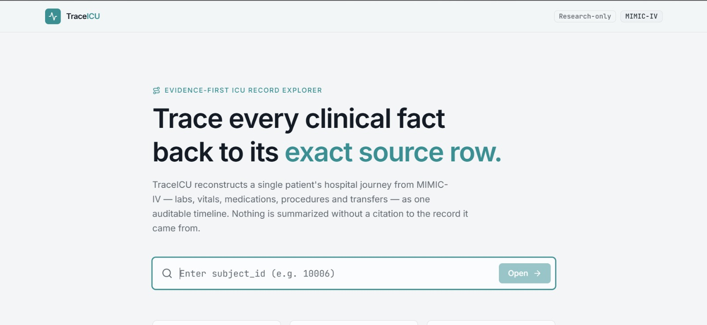
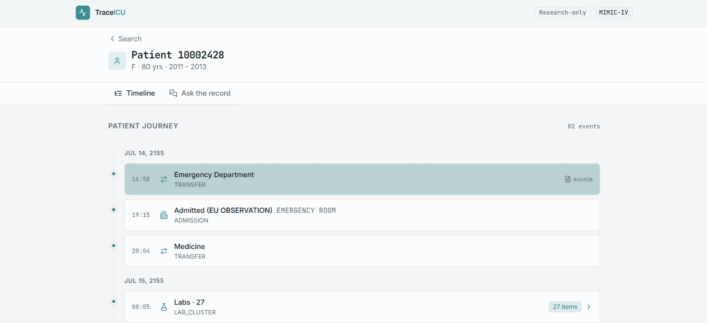
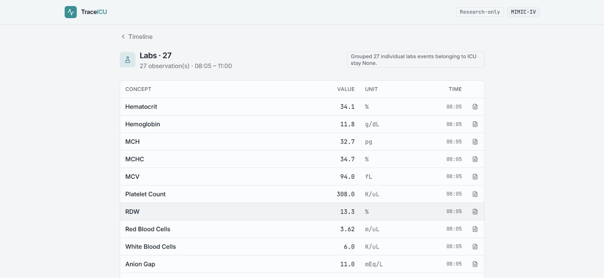
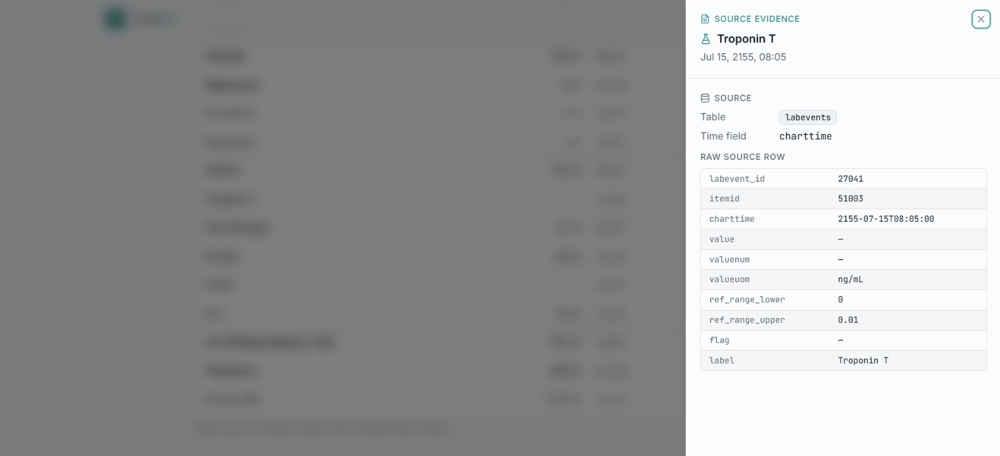
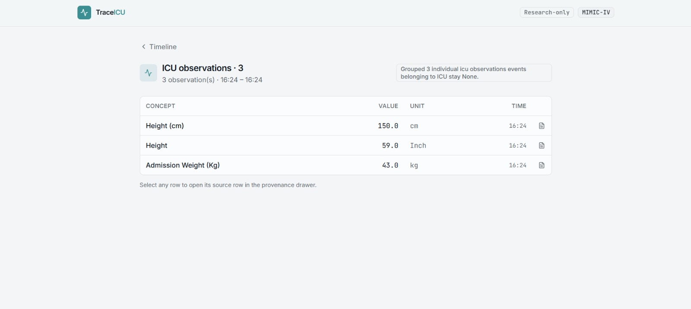
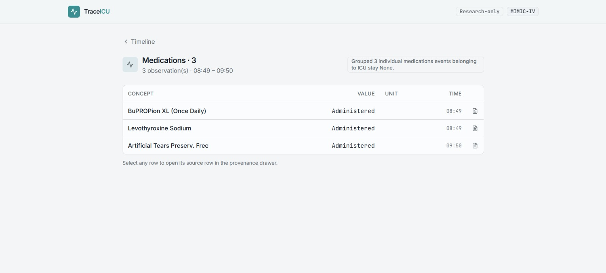
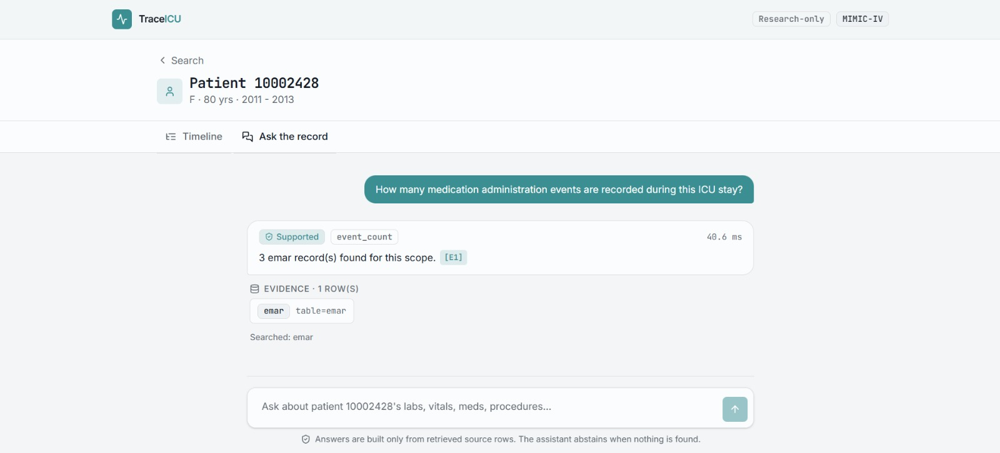

# TraceICU

### Evidence-first ICU Record Explorer

> **Trace every clinical fact back to its exact source row.**

TraceICU is an evidence-first clinical record exploration system built on the MIMIC-IV Clinical Database Demo.

It reconstructs a patient's hospital journey into a chronological, hierarchical timeline containing admissions, transfers, ICU stays, laboratory measurements, ICU observations, medications, and procedures. Each displayed clinical event preserves a direct link to the underlying source record, allowing users to move from a high-level timeline event to the exact database row that produced it.

TraceICU also provides a natural-language question interface for structured patient records. Instead of allowing an LLM to generate SQL or invent clinical answers, the system uses the LLM to classify the question into a controlled query intent. Actual data retrieval is deterministic, parameterized, and performed against DuckDB. The final answer is generated from retrieved records using fixed answer logic and is accompanied by evidence.

---

## ✨ Why TraceICU?

Clinical datasets contain enormous numbers of timestamped records distributed across multiple tables.

A single patient record can involve:

- multiple hospital admissions
- ward and ICU transfers
- laboratory events
- ICU observations
- medication administrations
- procedures
- multiple timestamps and identifiers
- records originating from different source tables

Finding the complete story of one patient can therefore become difficult even when all of the underlying information is available.

TraceICU addresses this problem by turning fragmented structured records into an **auditable patient journey**.

Instead of asking:

> "Where is this information stored?"

TraceICU lets the user ask:

> **"What happened, when did it happen, and exactly which source record proves it?"**

---

# 🎯 Core Capabilities

### 1. Patient Journey Reconstruction

TraceICU reconstructs a patient's chronological hospital journey from the underlying MIMIC-IV tables.

The timeline can contain:

- Admissions
- Transfers
- ICU stays
- Laboratory events
- ICU observations
- Medication administrations
- Procedures
- Discharge-related events

High-volume events such as labs, observations, and medications can be grouped into meaningful clusters while preserving their individual records.

### 2. Hierarchical Event Exploration

A user can move from:

```text
Patient Journey
    ↓
Hospital / ICU event
    ↓
Event cluster
    ↓
Individual clinical event
    ↓
Exact source row
```

For example:

```text
Labs · 27
    ├── Hematocrit
    ├── Hemoglobin
    ├── MCH
    ├── MCHC
    ├── MCV
    └── ...
```

### 3. Exact Data Provenance

Every individual event retains evidence describing where it came from.

The provenance view can expose:

- source table
- source time field
- source identifiers
- original field values
- clinical label
- timestamp
- other relevant raw-row fields

This makes TraceICU an **evidence-first interface rather than a black-box summarization tool**.

### 4. Natural-Language Patient Q&A

Users can ask questions about a patient's structured record using natural language.

Examples:

```text
What was the first sodium measurement during this ICU stay?
What medications were administered?
How many medication administration events are recorded?
What procedures were performed?
What transfers occurred?
What are the ICU stay details?
```

The application supports controlled intents including:

- timeline queries
- first measurement
- last measurement
- measurements within a time range
- medications
- procedures
- transfers
- ICU stay information
- event counts

---

# 🧠 Evidence-First AI Architecture

The central design principle is:

> **The LLM decides how to retrieve information — it does not decide what the clinical record says.**

```text
User Question
      │
      ▼
┌─────────────────────┐
│  LLM Intent Parser  │
│ Natural language →  │
│ structured JSON     │
└──────────┬──────────┘
           │
           ▼
┌──────────────────────────┐
│ Whitelisted Query Intent │
│ No arbitrary SQL         │
└──────────┬───────────────┘
           │
           ▼
┌──────────────────────────┐
│ Deterministic Retrieval  │
│ Parameterized queries    │
│ against DuckDB           │
└──────────┬───────────────┘
           │
           ▼
┌──────────────────────────┐
│ Retrieved Source Facts   │
└──────────┬───────────────┘
           │
           ▼
┌──────────────────────────┐
│ Evidence-backed Answer   │
└──────────────────────────┘
```

The LLM does not write SQL, select arbitrary database tables, or directly access the database. Unsupported questions are rejected or marked out of scope.

---

# 🤖 Model Details

| Component | Technology |
|---|---|
| LLM provider | Groq |
| Model | `llama-3.1-8b-instant` |
| Purpose | Natural-language question → structured query intent |
| Temperature | `0.0` |
| Output | Structured JSON query plan |
| Patient rows sent to LLM | No |
| SQL generation by LLM | No |

The model receives the user's question and returns a constrained query plan containing fields such as intent, domain, concept, time scope, and optional time boundaries.

## API Key Configuration

Create a `.env` file in the project root:

```env
GROQ_API_KEY=your_groq_api_key_here
```


For evaluation/demo environments, the evaluator can provide their own Groq API key.

---

# 🛡️ Safety and Abstention

TraceICU is deliberately designed not to behave like a clinical decision-making assistant.

Questions involving:

- diagnosis
- treatment recommendations
- prognosis
- clinical notes
- physician recommendations
- unsupported questions

are treated as out-of-scope or unsupported.

If the system cannot retrieve supporting records, it abstains rather than fabricating an answer.

TraceICU is not intended to provide diagnosis, treatment, triage, or clinical recommendations.

---

# 🔎 Provenance by Construction

For supported questions:

```text
Question
   ↓
Query Plan
   ↓
Database Retrieval
   ↓
Source Rows
   ↓
Answer
   ↓
Evidence References
```

The interface also allows individual timeline records to open a provenance drawer showing the source table and raw source-row fields.

---

# 🗄️ Data Layer

TraceICU uses **DuckDB** as a local, read-only analytical database.

Database:

```text
database/mimic.duckdb
```

Dataset:

**MIMIC-IV Clinical Database Demo v2.2**

The repository includes the MIMIC-IV demo data under:

```text
data/mimic/
```

TraceICU focuses on structured clinical information such as:

- laboratory events
- ICU observations
- medication administrations
- procedures
- admissions
- transfers
- ICU stays

---

# 🧩 Timeline Reconstruction

TraceICU reconstructs the timeline directly from source tables rather than creating a separate timeline table.

The reconstruction process:

1. Finds admissions for the requested patient.
2. Retrieves major journey events.
3. Retrieves high-volume clinical event sources.
4. Retrieves ICU stays.
5. Collects ICU observations.
6. Associates labs, medications, and observations with ICU stays using event timestamps.
7. Groups high-volume events into clusters.
8. Preserves individual source evidence.
9. Produces a chronological patient journey.

The source data remains the source of truth.

---

# 🖥️ User Experience

```text
Search Patient
      ↓
Open Patient
      ↓
Explore Timeline
      ↓
Open Event Cluster
      ↓
Inspect Individual Record
      ↓
Open Source Evidence
      ↓
Ask Questions About the Record
```

### Patient Search
Search for a MIMIC-IV subject and open the corresponding record.

### Timeline
View the patient's chronological hospital journey.

### Clustered Events
Open dense groups such as:

```text
Labs · 27
ICU observations · 3
Medications · 3
```

### Source Evidence Drawer
Inspect the exact source table and raw record fields behind an event.

### Ask the Record
Ask natural-language questions about the patient's structured record and receive evidence-backed answers.

---

# 🏗️ System Architecture

```text
                         ┌─────────────────────┐
                         │      React UI       │
                         │   Patient Explorer  │
                         └──────────┬──────────┘
                                    │
                                    ▼
                         ┌─────────────────────┐
                         │      FastAPI        │
                         │   Application API   │
                         └──────────┬──────────┘
                                    │
                ┌───────────────────┼───────────────────┐
                │                   │                   │
                ▼                   ▼                   ▼
        ┌──────────────┐    ┌──────────────┐    ┌──────────────┐
        │   Timeline   │    │  Retrieval   │    │  Patient     │
        │ Reconstruction│    │    Engine    │    │   Search     │
        └──────┬───────┘    └──────┬───────┘    └──────────────┘
               │                   │
               └──────────┬────────┘
                          ▼
                  ┌─────────────────┐
                  │     DuckDB      │
                  │  Read-only DB   │
                  └────────┬────────┘
                           │
                           ▼
                  MIMIC-IV Demo Data

                         ASK FLOW

        Question
           │
           ▼
      Groq LLM
           │
           ▼
   Structured Intent
           │
           ▼
 Parameterized Retrieval
           │
           ▼
    Source Records
           │
           ▼
 Evidence-backed Answer
```

---

# 🧰 Technology Stack

## Backend

- Python
- FastAPI
- DuckDB
- Pydantic
- python-dotenv

## AI

- Groq API
- `llama-3.1-8b-instant`

## Frontend

- React
- TypeScript
- Vite
- React Router
- Tailwind CSS
- Radix UI
- Lucide React

---

# 📁 Project Structure

```text
traceicu/
│
├── app/
│   ├── ai/
│   │   ├── answer.py
│   │   ├── concepts.py
│   │   ├── intents.py
│   │   ├── llm.py
│   │   ├── retrieval.py
│   │   └── schema.py
│   │
│   ├── cache.py
│   ├── config.py
│   ├── database.py
│   ├── main.py
│   ├── models.py
│   ├── subjects.py
│   └── timeline.py
│
├── database/
│   └── mimic.duckdb
│
├── data/
│   └── mimic/
│
├── frontend/
│   ├── src/
│   ├── package.json
│   └── ...
│
├── scripts/
├── evaluation/
├── requirements.txt
└── README.md
```

---

# 🚀 Getting Started

## Prerequisites

Install:

- Python 3.10+
- Node.js 18+
- npm
- Git

A Groq API key is required for natural-language Q&A.

## 1. Clone the repository

```bash
git clone https://github.com/Aniqa990/traceicu.git
cd traceicu
```

## 2. Create and activate a Python environment

### Windows PowerShell

```powershell
python -m venv .venv
.venv\Scripts\Activate.ps1
```

### macOS / Linux

```bash
python3 -m venv .venv
source .venv/bin/activate
```

## 3. Install backend dependencies

```bash
pip install -r requirements.txt
```

If required:

```bash
pip install groq
```

## 4. Configure the LLM API key

Create `.env`:

```env
GROQ_API_KEY=your_groq_api_key_here
```

Or temporarily in PowerShell:

```powershell
$env:GROQ_API_KEY="your_groq_api_key_here"
```

---

# ▶️ Run the Backend

From the project root:

```bash
uvicorn app.main:app --reload
```

A health endpoint is available at:

```text
/api/v1/health
```

---

# ▶️ Run the Frontend

Open another terminal:

```bash
cd frontend
npm install
npm run dev
```

Open the local Vite URL shown in the terminal.

---

# 🔌 Application Interface

The frontend communicates with the backend through application-level operations covering:

- patient search
- patient information
- timeline retrieval
- event drill-down
- evidence-backed natural-language Q&A

Example Q&A request:

```json
{
  "subject_id": 10002428,
  "question": "How many medication administration events are recorded?"
}
```

---

# 🧪 Example Questions

```text
What was the first sodium measurement during this ICU stay?

What was the last recorded sodium value?

What medications were administered?

How many medication administration events are recorded?

What procedures were performed?

What transfers occurred?

What are the ICU stay details?

What happened during this encounter?
```

---

# 🔐 Privacy, Security & Data Handling

TraceICU is intended for research and educational use.

Important design considerations:

- DuckDB is opened in read-only mode.
- The LLM is used for question/intent interpretation.
- The LLM does not directly access the database.
- The LLM does not generate SQL.
- Database retrieval is performed locally using deterministic queries.
- Answers are constructed from retrieved structured records.
- Unsupported questions are rejected or abstained from.

---

# ⚠️ Research / Educational Use Only

TraceICU is a **research and data-inspection prototype**.

It is **not** a medical device and must not be used for:

- diagnosis
- treatment decisions
- triage
- prognosis
- emergency decisions
- clinical recommendations

The MIMIC-IV Demo dataset is intended for research and educational use.

---

# 📊 Data Source

TraceICU uses the:

**MIMIC-IV Clinical Database Demo v2.2**

Official MIMIC-IV documentation:

https://doi.org/10.13026/07hj-2a80

---

# 🧭 Design Principles

### 1. Evidence over inference
Every clinical fact should be traceable to an underlying record.

### 2. Deterministic retrieval
The LLM should not be responsible for constructing database queries.

### 3. Controlled intelligence
The model operates within a predefined intent vocabulary.

### 4. Graceful abstention
When the system cannot support a question, it should say so rather than guess.

### 5. Progressive disclosure
Users see a clean high-level timeline first and can progressively drill down into individual records and source evidence.

---

# 🔮 Future Improvements

Potential next steps include:

- expanded clinical search and synonym matching
- richer timeline filtering and temporal visualization
- stronger bidirectional answer/evidence links
- larger automated evaluation benchmarks
- configurable LLM providers/models
- authentication and production deployment hardening
- observability, rate limiting, and secure secret management

---

## 📸 Interface Preview

The screenshots below represent the current TraceICU interface.

### Patient Search



### Patient Timeline



### Event Cluster



### Source Evidence



### ICU Observations



### Medications



### Ask the Record



---

# 🏁 Project Status

TraceICU is a functional research prototype demonstrating:

- patient search
- structured patient exploration
- hierarchical timeline reconstruction
- clustered clinical events
- source-row provenance
- deterministic evidence retrieval
- natural-language structured-record Q&A
- LLM-assisted intent classification
- abstention for unsupported or out-of-scope questions

The project is intended for demonstration, experimentation, and further development.

---

# 👥 Team

TraceICU was developed collaboratively as a three-member project combining:

- clinical data reconstruction
- evidence and provenance modeling
- deterministic retrieval
- AI-assisted natural-language interaction
- interactive patient exploration

The result is one integrated experience:

> **Explore the patient.  
> Follow the timeline.  
> Ask the record.  
> Verify the evidence.**

---

# 📄 Dataset Attribution

TraceICU uses the MIMIC-IV Clinical Database Demo.

Please review the dataset's license and usage terms before redistributing or deploying the data.

The repository includes MIMIC-IV demo documentation under:

```text
data/mimic/README.txt
```

---

# 🔗 Repository

**TraceICU**

https://github.com/Aniqa990/traceicu

---

## TraceICU

### **From fragmented clinical records to an auditable patient journey.**
